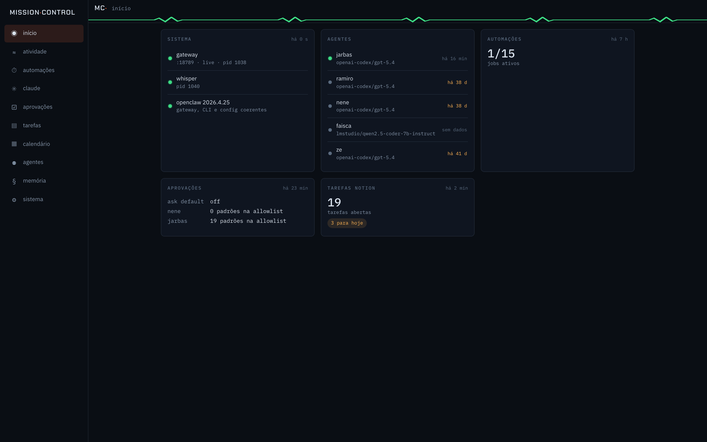
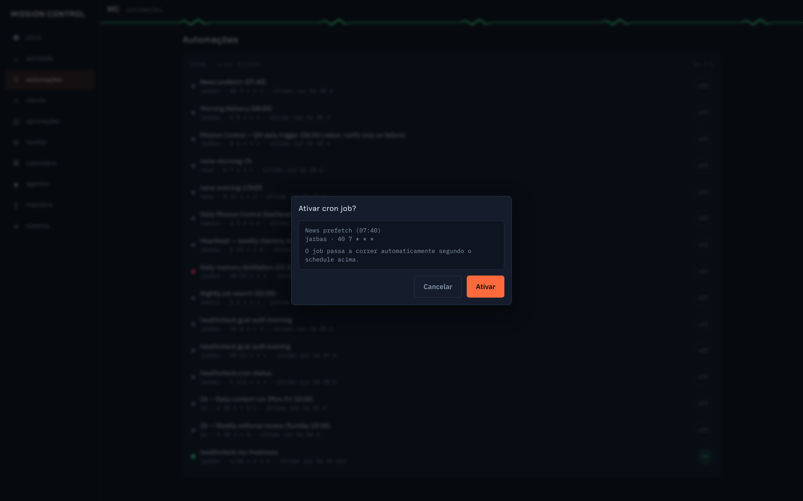
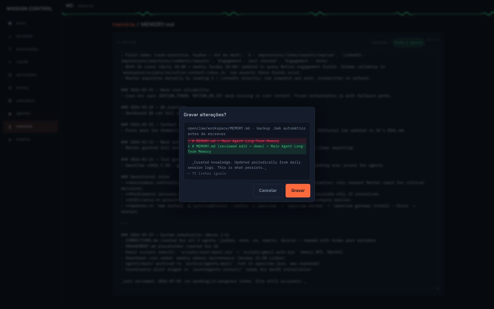
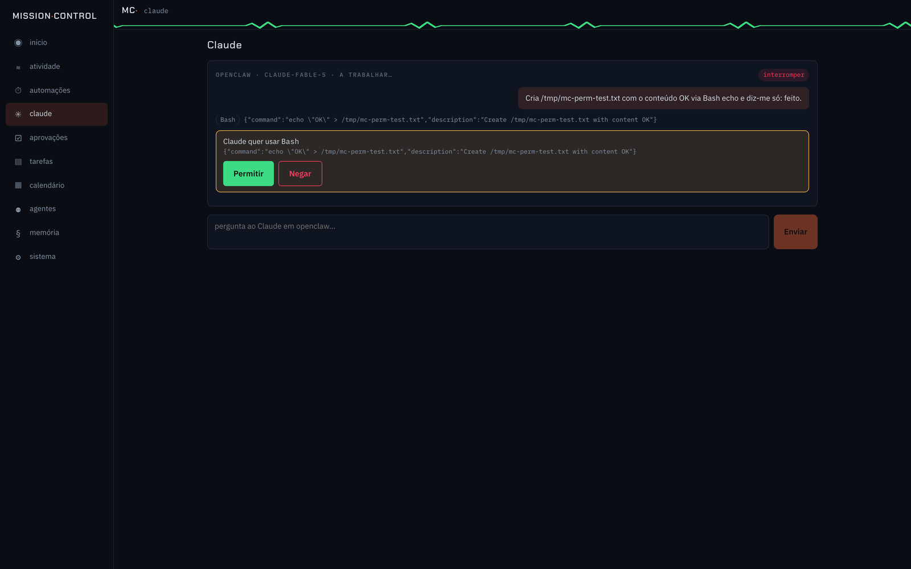
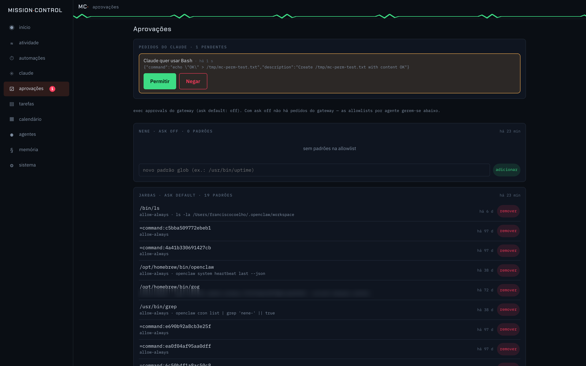
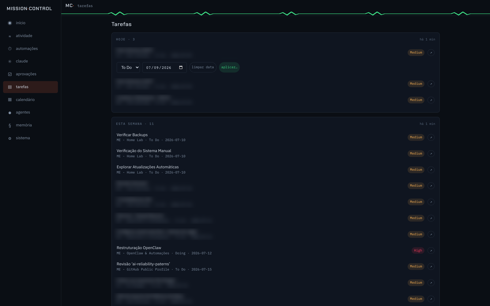

# Agent Mission Control

A mobile-first operations dashboard for a live multi-agent AI system - built
twice. The first version died in silence; this is the case study of the rebuild,
where every architecture decision is the post-mortem of v1, inverted.

**v2 status:** live since 2026-07-08 · single Node process (Hono + React SPA) ·
served over Tailscale to an iPhone PWA · every panel shows real system state,
every write goes through a confirm dialog and lands in an audit log.

> The production code operates a personal live system (agents with real
> Telegram/Discord traffic, personal memory files, private task DBs), so it
> lives in a private repo. This repo is the engineering story: the failure
> analysis, the design that came out of it, and the load-bearing code.



## The problem

Five AI agents (Telegram + Discord) run under a central gateway on a Mac mini:
scheduled cron jobs, an exec-approval queue, per-agent memory files, tasks in
Notion. Managing any of it meant SSH and a terminal. The goal: open a PWA on
the phone in the morning, understand the state of everything in one glance, and
do any common management action - including approving an AI coding agent's tool
calls - without a terminal.

## v1 died. Twice. That's the interesting part

v1 was a Next.js 15 + better-sqlite3 dashboard fed by a coordinator daemon.
It was archived after a two-stage silent death, and the post-mortem became the
spec for v2:

| v1 failure (evidence from the post-mortem) | v2 rule |
|---|---|
| Feeder daemon crash-looped for 3 weeks over a missing env var - launchd respawned it every 10s into a 106 MB log, and the DB silently stopped receiving data | **No feeder daemons.** Indexing is lazy, on request, incremental by file mtime. If the dashboard dies, nothing else breaks. |
| Intermediate SQLite DB was the source of truth; when the feeder died the DB rotted while the UI kept rendering it | **No intermediate DB as source of truth.** Reads go to the real files/HTTP at request time; SQLite is only a disposable index - deleting it loses nothing. |
| A Node upgrade broke `better-sqlite3` (native ABI mismatch) → every DB route returned 500, while static pages still rendered green | **Zero native modules.** `node:sqlite` is built-in; the smoke test inspects the *running process* and fails if any `.node` file is loaded. |
| Dead for 3 weeks before anyone noticed - `/api/health` returned 200 from cached static while everything behind it was broken | **Staleness visible everywhere.** Every panel shows the age of its data; plus an external ~40-line health probe (cron on the gateway → Telegram alert) that would have caught v1's death in 30 minutes. |
| Half-used schema, budget guardrails, risk-tiered SLAs - features nothing depended on | **Read-only by default; small surface.** Writes exist only where a human confirms them, and every one is audited. |

## Architecture

```
launchd: com.openclaw.missioncontrol → node (absolute path), port 3001, bind 127.0.0.1
  server/  Hono: static SPA + /api/* + /ws/claude (Agent SDK) + /ws/live (fs.watch push)
  web/     Vite + React 19 SPA (PWA, mobile-first)
  data/    index.db (disposable session index) + mc.db (audit/settings) - node:sqlite
Tailscale Serve: TLS :443 → 127.0.0.1:3001 (tailnet-only, iPhone PWA)
```

One process, one LaunchAgent. The SPA build is a deploy step, not a runtime
concern. If the agent gateway is down, a red banner appears and everything
file-backed keeps working.

**Reads vs writes, measured:** spawning the system's CLI takes **~5.8s** (Node
boot + gateway WebSocket roundtrip); reading the same state from its files
takes **~13ms**. So reads never touch the CLI - they parse the system's own
files (JSONL session logs, cron state JSON) with the mtime as a visible
staleness marker. Mutations go through the CLI (the stable contract), behind a
confirm dialog where 6 seconds is fine. All coupling to the underlying system
is isolated in six adapter files.

## The write-safety model

Every mutation - cron toggles, gateway allowlists, memory edits, Notion status
changes - is protected by the same three layers (server-enforced, not UI
convention):

```ts
/**
 * Every mutation body must carry `{confirm: true}` - placed there by the
 * ConfirmDialog in the UI, never by default. Rejecting here keeps curl/typos
 * from mutating the live system without a human having seen the effect.
 */
export async function confirmedBody<T extends Record<string, unknown>>(
  c: Context,
): Promise<{ body: T } | { response: Response }> {
  const body = (await c.req.json().catch(() => null)) as (T & { confirm?: unknown }) | null;
  if (!body || body.confirm !== true) {
    return { response: c.json({ error: 'mutation requires {confirm: true}' }, 400) };
  }
  return { body };
}
```

On top of that: a global rate limit on mutation verbs (stops a stuck retry
loop, the realistic failure for a single-user tool), and an audit row in the
dashboard's own DB for every attempt - success *and* failure. Memory-file
edits add a path allowlist (canonicalize, then prefix-check), a timestamped
`.bak` before every write, and an mtime guard that returns 409 if the file
changed since it was opened.





## Approving an AI agent's tool calls from a phone

The dashboard embeds a Claude Code chat panel via the Agent SDK. The SDK's
`canUseTool` callback is the permission gate: instead of a terminal prompt,
each request becomes a pending promise surfaced as an approval card - in the
chat *and* in a global approvals inbox, so a request made from one device can
be decided from another:

```ts
canUseTool: (toolName, toolInput, { signal }) => {
  const id = randomUUID();
  send({ type: 'permission_request', id, toolName, preview: preview(toolInput) });
  return new Promise<PermissionResult>((resolve) => {
    pendingPermissions.set(id, { toolName, toolInput, finish: resolve });
    pendingRegistry.set(id, /* …the /approvals inbox decides via REST… */);
    signal.addEventListener('abort', () =>
      finish({ behavior: 'deny', message: 'request aborted' }));
  });
},
```





One deliberate choice worth calling out: when the chat panel's SSE connection
closes (navigating away, closing the tab), every pending permission is denied
with "connection closed" rather than left waiting. A request can outlive the
surface that created it only if another surface (the approvals inbox on a
second device) is there to decide it - nothing stays approvable with nobody
watching.

## Surfaces

Overview · activity timeline (agent sessions + cron runs) · automations (cron
toggles/run-now with run history) · calendar (cron projections + task due
dates) · tasks (Notion, status/due editing) · approvals inbox (gateway
allowlists + Claude tool permissions) · agents · memory browser/editor (+
read-only Obsidian vault with navigable wikilinks) · Claude Code chat · system
health with the audit log.



## Stack

Vite + React 19 + TypeScript strict (SPA, no SSR) · Hono on Node ·
`node:sqlite` · `@anthropic-ai/claude-agent-sdk` · TanStack Query + two
WebSockets (chat stream, live push via fs.watch) · launchd + Tailscale Serve ·
vitest · gitleaks pre-commit.

Deliberately boring choices: no SSR/hydration (nothing here needs it), no CSS
framework, no ORM, dependency tree kept small enough to audit by hand - v1's
grave is marked "broke on a routine upgrade".

## License

MIT - see [LICENSE](LICENSE)
